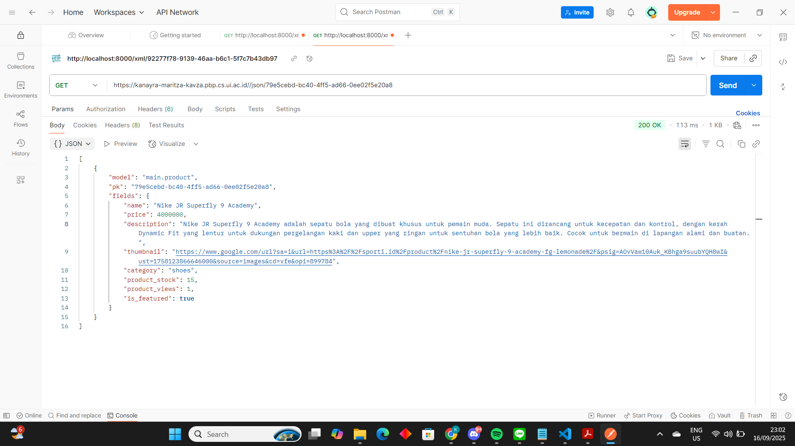

# Tugas Individu 1 
# Kanayra Maritza Sanika Adeeva
# Kelas C - 2406437880

# Tautan menuju aplikasi pws yang sudah dideploy: 
https://kanayra-maritza-kavza.pbp.cs.ui.ac.id/

1. Jelaskan bagaimana cara kamu mengimplementasikan checklist di atas secara step-by-step (bukan hanya sekadar mengikuti tutorial).
Jawab: 

# Set up awal, sebelum masuk ke implementasi MVT 

Step 1 : Jadi pertama, untuk membuat proyek django baru saya membuat direktori baru di documents yang bernama football-shp lalu pada command prompt saya mengaktifkan virtual environment. 

Step 2 : Kedua, saya menyiapkan serta menginstalansi semua dependencies (modul yang diperlukan software untuk berjalan termasuk di dalamnya library, framework, dan package), dan saya memasukkan dependencies setelah memastikan bahwa virtual environment aktif supaya dependencies dapat terisolasi antara proyek2 yang beda2 ke depannya.

Step 3 : Setelah semua dependencies terinstall, saya membuat proyek django yang bernama football-shop

Step 4 : Lalu, di dalam root proyek yang sama dgn manage.py saya membuat file .env dan menambah production = false. Environment variables (env) ini yang membuat kode yang sama berjalan di environment yang beda tanpa perlu mengubah kode. 

Step 5 : Setelah membuat file .env saya membuat file .env.prod pada direktori yang sama, dalam hal ini yang dibedakan adalah production = true, dimana file ini dipakai untuk production deployment, sedangkan .env dipakai utk development lokal. Production = true pada .env.prod menandakan bahwa aplikasi kita memakai database PostgreSQL dengan kredensial database yang diperoleh mengenai email ui kami. 

Step 6 : Setelah itu, saya memodif settings.py untuk menggunakan environment variables serta menambahkan allowed host, dimana tujuan dari menambahkan allowed host adalah mendaftarkan host yang diizinkan untuk mengakses aplikasi web kita. Dalam hal ini saya hanya mengizinkan akses dari host lokal (hanya jaringan saya saja)

Step 7 : Setelah itu saya menambah konfigurasi production serta mengubah konfigurasi database pada file settings.py

Step 8 : Setelah melakukan konfigurasi environment variables dan proyek, saya menjalankan server dan hal yang pertama saya lakukan adalah migrasi database terlebih dahulu, setelah itu baru menjalankan server django.

Step 9 : Setelah server dijalankan, saya menghubungkan repositori lokal dengan repositori github yang baru (berbeda dgn tutorial) dan juga membuat branch utama bernama master. Setelah itu, dari direktori repositori lokal saya add commit dan push. 

Step 10 : Lalu, pada PWS saya membuat proyek baru yaitu footballshop, setelah memastikan bahwa environment variable saya di proyek PWS sudah tersimpan dengan baik di environs, saya menambah URL deployment pada allowed host di settings.py supaya proyek saya bisa diakses melalui url deployment pws juga. 

Step 11 : Terakhir, saya melakukan push ke PWS dengan credentials dari proyek yang saya buat. Setelah itu, saya melihat bahwa statusnya sudah building dan web syaa berhasil di deploy

# Masuk ke implementasi MVT
# Implementasi template
Step 12 : setelah memastikan web saya sudah bisa diakses di URL deployment, saya membuat direktori aplikasi main pada proyek football news dengan. Main tersebut saya tambahkan pada list elemen di variabel INSTALLED_APPS pada settings.py. Tujuannya supaya proyek bisa menjalankan aplikasi main (langkah ketiga checklist tugas)

Step 13 : Setelah membuat main, sya membuat template untuk menampilkan data program football shop yang pernama dimulai dengan membuat berkas html yang berisi nmama kelas dan npm saya. 

# Implementasi model dasar
Step 14 : Setelah itu, pada direktori main saya mengisi models py saya dan membuat model dengan nama Product beserta atribut wajib di dalamnya sesuai ketentuan soal dan category pilihan. 

Step 15 : Setelah itu membuat atribut, saya membuat dan mengaplikasikan migrasi model ke basis data. 

# Menghubungkan view dengan template
Step 16 : Setelah melakukan migrasi, saya mengimpot modul yang mengandung fungsi render pada views.py dalam direktori main supaya tampilan HTML bisa dirender dengan data yang diberi, setelah itu saya mendeklarasikan fungsi show_main yang mengembalikan tampilan yang sesuai dengan permintaan HTTP. Jadi nama kelas, npm, dan nama saya disini ditulis secara eksplisit, bukan lagi di main.html.

Step 17 : Setelah itu, saya mengubah template main.html supaya bisa menampilkan data yang diambil dari model yang dimana punya fungsi show_main tadi. Saya membuat template variables disini.  (untuk mengimplementasikan checklist ke-5)

# Konfigurasi routing URL
Step 18 : Setelah template dibuat, saya melakukan konfigurasi routing pada url aplikasi main supaya bisa memetakan fungsi yang dibuat pada views.py (yang berisi data diri saya). Disini saya membuat file urls.py pada direktori main dan import path untuk definsiikan pola url serta import fungsi show_main suaya dia bisa terpanggil ketika url cocok dengan pola

Step 19 : Setelah itu, saya mengonfigurasi routing url proyek supaya proyek bisa memetakan rute URL pada aplikasi main. Setelah itu, saya jalankan proyek django saya dan berhasil membuka local host di web browser. 

Step 20 : Setelah semuanya selesai, saya mendeploy semuanya ke PWS seperti yang sudah saya lakukan di atas supaya aplikasi saya bisa diakses. 

# Langkah SELESAI 

2. Buatlah bagan yang berisi request client ke web aplikasi berbasis Django beserta responnya dan jelaskan pada bagan tersebut kaitan antara urls.py, views.py, models.py, dan berkas html.

- Client(user) mengirim request (mengetik link) melalui internet/jaringan yang akan diterima oleh Django server

- Django melihat urls.py dan mencocokkan pola URL disitu dengan request, lalu menentukan function/class mana yang harus dipanggil dari views.py.

- Views.py berisi logika bagaimana menangani request #menentukan apa yang harus dilakukan.Jika diperlukan, view akan mengambil data dari database menggunakan models.py.

- Pada models.py, terdapat definisi tabel database dalam bentuk class Python. Setelah data didapat dari models.py, views.py akan memanggil fungsi render() dimana render menggabungkan template HTML dengan data (context).

- Lalu, dikirim kembali sebagai HTTP Response kembali response ke browser client

-  Browser client menerima response HTML, membacanya dan menampilkannya menjadi halaman web yang bisa kita liat di layar.

# Gambar Flow Request Client: Terdapat pada folder pictures yang berisi Request Client Flow.jpg

3. Jelaskan peran settings.py dalam proyek Django!
Jawab: 
- Settings.py menyimpan pengaturan keamanan proyek yang meliputi:
SECRET_KEY -> kunci rahasia untuk signing session, password reset token, dan lain lain. 
DEBUG -> mode debug yang dimana disetting true untuk development dan false untuk production
ALLOWED_HOSTS -> daftar host yang diizinkan mengakses aplikasi

- Settings.py juga menyimpan pengaturan aplikasi:
INSTALLED_APPS -> menyimpan semua dafar app Django yang aktif, contoh dari tutorial kami menambah app 'main' dimana di dalamnya  terdapat file models.py, views.py dan template serta lainnya.

- MIDDLEWARE -> menyimpan daftar komponen yang memproses request berurutan. 

- Terdapat ROOT_URLCONF yaitu file utama yang memetakan URL ke view serta TEMPLATES yaitu pengaturan untuk template engine Django

- Tempat django membuat koneksi database dan menjalankan migrasi

Kesimpulannya settings.py menentukan apa aplikasi yang dijalankan, bagaimana cara menjalankannya serta dimana resource disimpan.

# Cara kerja migrasi database Django
4. Bagaimana cara kerja migrasi database di Django?
Jawab: 
Pada tutorial dijelaskan bahwa migrasi wajib dilakukan untuk merefleksikan perubahan setiap kali kita melakukan perubahan pada model. Cara kerjanya adalah:

- Ketika kita menjalankan python manage.py makemigrations, django membuat konfigurasi proyek dan semua AppConfig dari INSTALLED_APPS pada settings.py sehingga tau app "main" ada dimana

- Django membangun 2 state yaitu old_state yaitu struktur yang terakhir tercatat (jika sudah ada sebelumnya) dan new_state yaitu struktur yang terbaru based on models.py. 

- Lalu terdapat Autodetector yang mendeteksi perbedaan dan menghasilkan daftar operations.

- Setelah itu, terdapat migrationwriter yang menulis file migrasi Python yang berisi class Migration dengan atribut dependencies dan operations. Dalam hal ini "0001_initial.py"

- Lalu ketika user menjalankan python manage.py migrate perintah di command prompt, django membaca semua file migrasi (yang belum diterapkan)

- Setelah itu, membangun dependency graph dari semua migrasi YANG TUJUANNYA menentukan urutan eksekusi. 

- Lalu, terdapat migrationExecutor yang mengeksekusi migrasi satu per satu mengikuti urutan dan dependency. 

- Setelah operasi sukses, Django menambahkan record ke tabel django_migrations, hasil akhirnya adalah tabel fisik di database berubah sesuai instruksi.

5. Menurut Anda, dari semua framework yang ada, mengapa framework Django dijadikan permulaan pembelajaran pengembangan perangkat lunak?
Jawab : 
- Django memiliki kerangka kerja yang well-organized jadi membuat kami mudah untuk belajar. Berdasarkan data yang saya dapat, Django menyediakan API, library, hingga modul. Lalu, juga framework ini memakai programming language python yang dimana itu adalah high level programming language. Lalu, dengan arsitektur MTV yang sudah kita pelajari, kita bisa membuat template script bawaan yang bisa langsung dipakai.

- Pengembangan dan perawatan yang mudah. Dalam hal ini django menerapkan model view controller yang membagi kode ke bagian2 jelas yaitu model utk data, view utk logics, dan template untuk tampilan. Struktur kode ini mudah dikembangkan dalam skala aplikasi yang semakin besar. 

- Unggul dalam fitur keamanan, misal ketika menulis username dan password django menyimpan informasi krenensial ke dalam database sehingga lebih aman. Django punya berbagai fitur keamanan otomatis, contoh mencegah SQL injection, XSS, dan CSRF. Jadi pengguna yang masih awam tidak perlu ribet memikirkan celah keamanan. 

- Django memiliki fleksibilitas yang tinggi dan bisa beroperasi di berbagai platform. Bisa di server hosting manapun, kita ambil contoh dari yang umum yaitu Windows, Linux, dan MacOS sehingga cocok untuk permulaan pembelajaran pengembangan software. 

6. Apakah ada feedback untuk asisten dosen tutorial 1 yang telah kamu kerjakan sebelumnya?
Jawab : Asdos untuk Tutorial 1 kemarin sangat helpful meski lab dilaksanakan secara online. Contohnya, saya sempat mengalami masalah dalam mengaktifkan environment di Windows, dan asdos langsung tanggap membantu sehingga saya bisa menyelesaikan lab tepat sebelum waktu berakhir. Terima kasih dan sukses selalu untuk tim asdos!!

# Tugas Individu 2
# Kanayra Maritza Sanika Adeeva
# Kelas C - 2406437880

To-Do List:
- Tambahkan 4 fungsi views baru untuk melihat objek yang sudah ditambahkan dalam format XML, JSON, XML by ID, dan JSON by ID. (Sudah)
- Membuat routing URL untuk masing-masing views yang telah ditambahkan pada poin 1. (Sudah)
- Membuat halaman yang menampilkan data objek model yang memiliki tombol "Add" yang akan redirect ke halaman form, serta tombol "Detail" pada setiap data objek model yang akan menampilkan halaman detail objek. (Sudah)
- Membuat halaman form untuk menambahkan objek model pada app sebelumnya. (Sudah)
- Membuat halaman yang menampilkan detail dari setiap data objek model.

# Jawab: 
# Jelaskan mengapa kita memerlukan data delivery dalam pengimplementasian sebuah platform?
-> Data delivery mendukung real-time processing dan decision making yang dimana ini penting supaya platform bisa segera mengeksekusi tindakan sesuai kondisi terbaru tanpa menunggu batch processing manual.
-> Mengurangi risiko data inconsistency dalam hal ini seperti data yang hilang, terduplikasi, atau tidak sinkron ketika berpindah antar komponen. Jadi dengan adanya data delivery, data tetap utuh dan konsisten selama proses transfer dari sumber ke tujuan sehingga semua bagian platform bekerja dengan informasi yang sama.
-> Setiap action dan proses yang terjadi pada platform dapat dilacak dan direcord karena ini penting dalam memberi visibilitas penuh terhadap bagaimana data mengalir di sistem yang penting untuk debugging. 
-> Memungkinkan platform menangani volume yang data besar tanpa kehilangan performa karena seiring bertumbuhnya platform, volume data yang diproses juga meningkat. Data delivery dirancang untuk mendukung skalabilitas yang dapat memungkinkan platform tetap bisa beroperasi stabil meski menerima data yang besar (tidak ada downtime)

# Menurutmu, mana yang lebih baik antara XML dan JSON? Mengapa JSON lebih populer dibandingkan XML?
Berdasarkan studi dan artikel yang ada memang JSON lebih sering dipilih dibanding XML karena alasan berikut:
- File JSON rata-rata ukurannya lebih kecil dibanding XML karena JSON tidak memakai tag pembuka atau penutup yang banyak "<>" sehingga dapat mengurangi latency (penundaan waktu yang terjadi antara saat tindakan dimulai dan saat hasilnya diamati)
- Sintaksnya yang lebih sederhana sehingga mudah ditulis dan dibaca saat dan membuat mudah saat mendefinisikan objek oleh manusia.
- JSON merupakan native support di beberapa platform dan bahasa pemrograman lain contohnya javascript sehingga integrasi jadi lebih mudah. Jadi kita bisa mengurai JSON dengan fungsi JavaScript dan waktunya lebih cepat dan efisien.
- Format JSON yang menggunakan key value membuat parsingnya lebih cepat dibanding XML.  

# Jelaskan fungsi dari method is_valid() pada form Django dan mengapa kita membutuhkan method tersebut?
Secara garis besar method is_valid() memastikan apakah data yang disubmit ke form sesuai aturan yang sudah ditentukan di form. Aturan ini bisa berupa required field, panjang karakter, maupun validasi lainnya yang dibuat oleh developer. Seperti contoh, apakah field yang wajib diisi (required=True) benar-benar ada isinya, apakah panjang data sesuai batas max_length, min_length. Ketika semua data valid, Django akan menyimpan hasil data yang sudah dibersihkan ke atribut cleaned_data,sebaliknya jika ada data yang tidak sesuai aturan maka Django memberi pesan error kepada user. 

Kita membutuhkan method tersebut supaya data yang masuk ke database bersih dan sesuai aturan, kemudian tidak perlu juga untuk membuat logic yang mengecek satu per satu karena sudah dihandle Django. Setelah itu, user bisa mendapat feedback langsung jika mereka mengisi form dengan format yang salah jadi terdapat feedback secara jelas untuk user. Dengan validasi yang ada di awal, data yang salah dapat langsung dihentikan sebelum dipakai ke tahap selanjutnya (jadi potensi error berkurang)

# Mengapa kita membutuhkan csrf_token saat membuat form di Django? Apa yang dapat terjadi jika kita tidak menambahkan csrf_token pada form Django? Bagaimana hal tersebut dapat dimanfaatkan oleh penyerang?
csrf_token disisipkan di setiap form di Django yang berfungsi memastikan bahwa form benar benar dikirim dari situs kita sendiri bukan dari eksternal, jadi tiap ada request POST masuk, Django akan memverifikasi token ini. Web saat ini seringkali memakai session login, ketika user login browser mengirimkan cookie session ke server in every request. Namun, cookie juga terkirim walau request dari situs lain (bukan situs kita sendiri), tanpa csrf_token server tidak bisa membedakan apakah request benar-benar dibuat dari form di situs yang sah atau diam diam dikirim oleh situs luar. Oleh karena itu, kita butuh csrf_token karena tiap form akan diberi kode unik yang hanya valid untuk sesi user tersebut. Kode ini dikirim bersama request POST. 

Penyerang bisa memanfaatkan tidak adanya csrf_token melalui tahap di bawah:
- Korban login pada situs target (browser menyimpan cookie session)
- Penyerang mengelabui korban untuk membuka halaman tidak sah dimana halaman itu membuat browser korban mengirim request ke situs target
- Cookie session dikirim otomatis oleh browser, server (tidak sah) melihat request itu sebagai request dari korban yang sah
- disini hal pentingnya: Jika server tidak ada mekanisme tambahan untuk memverifikasi asal request, server bakal menjalani aksi tersebut dan penyerang mencapai plannya.

# Jelaskan bagaimana cara kamu mengimplementasikan checklist di atas secara step-by-step (bukan hanya sekadar mengikuti tutorial).
- Langkah pertama: Mengimplementasikan skeleton sebagai kerangka views website supaya terdapat konsistensi desain website dan meminimalisir redundansi. Pembuatan skeleton tersebut dilakukan dengan cara membuat direktori template di root folder dan mengisinya dengan base.html, setelah itu kita harus memastikan di settings.py bahwa base.html terdetect sebagai template. Template ini akan diextend oleh file lain pada direktori yang berbeda, dalam hal ini diextend oleh main.
- Langkah kedua: Membuat form untuk menambahkan objek model produk baru pada app pada direktori main dengan cara membuat file python baru yang bernama forms.py. Disini kita harus mengimport ModelForm sebagai parameter pada class productForm. Pada class forms.py itu kita tambahkan kategori sesuai yang sudah kita buat di tugas individu 1. 
- Langkah ketiga: Supaya halaman form bisa digunakan untuk menambah objek produk dan menampilkan detail data, kita harus menambah 2 function baru pada views.py yaitu create_product yang menerima parameter request dan show_product yang menerima parameter request dan id produk. 2 fungsi ini berupa perintah yang diinisiasi.  Create_product dipakai untuk menghasilkan form yang dapat menambah data product automatically ketika disubmit. Show_product dipakai untuk mengambil objek Product berdasaekan id, dan jika tidak ditemukan akan dikembalikan halaman 404. 
- Langkah keempat: Seperti biasa, kita harus menambahkan path URL ke variabel urlpatterns pada urls.py dan mengimport fungsi yang sudah dibuat
- Langkah kelima: Setelah membuat fungsi pada views dan membuat routing URL masing-masing fungsi pada views yang telah saya sebutkan, sekarang kita membuat supaya halaman yang menampilkan data objek model memiliki tombol Add Product yang bakal redirect ke halaman form dan tombol Detail. Hal itu dilakukan dengan cara mengupdate main.html.
- Langkah keenam: 
Untuk membuat tombol add product yang akan redirect ke halaman form kita butuh memodifikasi main.html dan membuat create_product.html untuk halaman form untuk menambah objek model. Lalu, untuk menampilkan detail data objek model maka kita membuat template news_detail.html. 
- Langkah ketujuh: Pastikan kita menambahkan URL deployment PWS pada CSRF_TRUSTED_ORIGINS.
- Langkah kedelapan: Setelah itu kita ingin supaya kita bisa melihat objek yang ditambahkan dalam formal XML dan JSON secara menyeluruh. Maka dari itu kita membuat fungsi baru bernama show_xml dan show_json. Dalam masing2 method terdapat variabel yang menyimpan hasil query seluruh data pada Product. Dalam fungsi itu terdapat serializers untuk mentranslate objem model menjadi format lain dalam hal ini JSON atau XML. Lalu, setelah itu kita menambahkan path url seperti biasa pada urlpattern untuk mengakses fungsi di views. 
- Langkah kesembilan: Saat ini kita ingin melihat objek dalam format XML by ID dan JSON by ID, oleh karena itu caranya sama seperti langkah ke delapan yaitu membuat fungsi pada views namun kali ini dengan parameter request dan news_id. Namun saat ini variabel dalam fungsi menyimpan hasil query data dengan id tertentu menggunaakan filter() atau get().Perbedaan dengan 2 fungsi sebelumnya adalah, di dua fungsi ini jika id produk tidak ditemukan akan ada status 404 sebagai responsenya.
- Langkah kesembilan: Jika fungsi sudah dibuat pada views dah sudah juga ditambahkan ke urlpatterns maka sekarang kita akan melihat data tersebut menggunakan postman. 

- SELESAI - 

# Apakah ada feedback untuk asdos di tutorial 2 yang sudah kalian kerjakan?
Jawab: 
Secara keseluruhan, kinerja asdos pada tutorial 2 kemarin sangat membantu, walaupun lab dilaksanakan secara offline namun asdos tetap semangat dan sangat cepat tanggap untuk ngasih kami solusi atas beberapa kendala yang kami alami, khususnya saya. Terimakasih saya ucapkan kepada tim asdos dan sukses selalu kak. 

# Hasil akses URL pada postman 
 menunjukkan json
 menunjukkan xml
  -> menunjukkan json by id produk
 -> menunjukkan xml by id produk

# Tugas Individu 4
# Kanayra Maritza Sanika Adeeva
# Kelas C - 2406437880

# Apa itu Django AuthenticationForm? Jelaskan juga kelebihan dan kekurangannya.
Jawab:
Django AuthenticationForm adalah form bawaan Django yang dipakai untuk melakukan proses login pengguna fungsinya adalah memvalidasi username dan password yang diinput user, mengecek apakah user ada di database, mengecek apakah password sesuai dengan hash yang tersimpan, memastikan akun aktif atau tidak (dengan mengggunakan is_active).

Kelebihan:
- Sudah terdapat mekanismenya sehingga built-in praktis dan kita tidak perlu menulis validasi login manual
- Langsung terintegrasi dengan model User bawaan Django, sistem session dan middleware
- Password otomatis dicek menggunakan hashing, ada proteksi dari akun yang non-aktif, serta error tidak memberikan detail berlebih. 
- Bisa diextend untuk menambah field tambahan misal captcha, email login dll

Kekurangan:
- Terbatas pada field default,  disini AuthenticatonForm hanya menyediakan username dan password jika aplikasi butuh login via email, phone number, atau multi-factor authentication perlu kostumisasi lagi
- Error message bawaannya terlalu standar sehingga perlu diubah agar lebih ramah pengguan
- Tidak mendukung fitur modern secara langsung misal login dengan sosial media (Google, Facebook), OTP, atau SSO tidak tersedia out of the box jadi butuh library tambahan
- Kurang fleksibel untuk UI yang modern, default rendering form tidak cocok untuk frontend framework modern. 

# Apa perbedaan antara autentikasi dan otorisasi? Bagaiamana Django mengimplementasikan kedua konsep tersebut?
Autentikasi : Proses untuk memverifikasi identitas pengguna (dalam hal ini pertanyaan yang dijawab adalah "siapakah anda") contohnya adalah user memasukkan username dan password lalu sistem mengecek di database, hasilnya adalah sistem yakin pengguna itu benar-benar siapa yang dia klaim

Cara mengimplementasikan autentikasi akun pada django:
Pada django autentikasi dihandle oleh sistem bawaan yaitu django.contrib.auth. 

- Proses dimulai dengan registrasi user yang baru menggunakan UserCreationForm yang dimana form ini bawaan Django yang sudah disiapkan di django.contrib.auth.forms dan langsung terhubung dengan model User. Field dari UserCreationForm adalah username, password utama, dan konfirmasi password. Selain 3 field itu UserCreationForm juga punya logika validasi bawaan yaitu untuk mengecek apakah username sudah dipakai, cek apakah password awal dan konfirmasi sama, dan cek apakah password memenuhi aturan keamanan. Password dalam hal ini tidak disimpan dalam entuk asli tetapi di-hash dengan algottma seperti PBKDF2 atau ARGON.

- Saat user ingin login, Django menerima data username dan password melalui AuthenticationForm.  Data diverifikasi dengan fungsi authenticate(request, ...) yang akan mencocokkan password input dengan hash yang sudah tersimpan di basis data. Jika sesuai, fungsi login() akan dipanggil to make the session. Django menyimpan session ID di browser dalam bentuk cookie(sessionid). Tiap request selanjutnya django jadi bisa kenal user yang sedang aktif melalui middleware dan otomatis mengisi request.user

- Untuk proteksi akses, Django punya decorator @login_required tujuannnya untuk memastikan hanya user yang sudah login yang bisa membuka halaman tertentu. Django juga memiliki sistem authorization berupa grup dan permission yang dapat dipakai untuk mengatur hak akses lebih detail.

- Lalu, jika user mau logout, fungsi logout() dipanggil untuk hapus sessionnya sehingga request.user kembali jadi AnonymousUser (seperti implementasi di tutorial kemarin), Lalu django juga memungkinkan pegelolaan cookie tambahan, misal untuk penggunaan cookie last_login untuk menampilkan kapan terakhir kali user masuk.

Otorisasi: Proses untuk menentukan apa yang boleh dilakukan pengguna setelah identitasnya terverifikasi. 

Cara mengimplementasikan otorisasi akun pada django:
Setelah proses autentikasi berhasil dan user dikenali, Django menentukan apa saja yang boleh dlakukan user tersebut melalui permission, groups dan flag khusus seperti is_staff dan is_superuser. Secara default, Django membuat permission dasar untuk tiap model yang dimana permission ini bisa diberikan langsung ke user atau melalui sebuah group. Untuk memeriksa izin dalam aplikasi, Django memiliki metode has_perm() di objek request.user serta decorator seperti @permission_required untuk membatasi akses ke view tertentu. Sama seperti pada autentikasi, Django juga menyediakan @login_required untuk memastikan hanya user yang sudah login yang bisa mengakses halaman tertentu. Lalu, Django juga menambah atribut is_staff untuk nentuin apakah user bisa masuk ke admit site dan is_superuser untuk memberi akses penuh unlimited ke seluruh sistem. Jika  action tidak diizinkan,  Django akan menolak akses dan mengarahkan user ke halaman login atau menampilkan pesan error sesuai konfigurasi.

# Apa saja kelebihan dan kekurangan session dan cookies dalam konteks menyimpan state di aplikasi web?
Jawab: Cookies adalah file teks kecil yang dibuat dan disimpan oleh browser user di komputer atau HP ketika kta membuka website lalu dihapus sesuai waktu yang ditentukan user di browsernya. Cookies menyimpan informasi mengenai contohnya preferensi pengguna di servernya dan berperan penting dalam melakukan verifikasi identitas pengguna.

Kelebihan: 
-  membuat website cukup bisa menyimpan data langsung di browser user tanpa butuh server tambahan
- Cookie bisa mengingat preferensi pengguna contohnya bahasa, tema, opsi tampilan. 
- cookies didukung oleh hampir semua browser modern
- memudahkan tracking karena website bisa tahu kebiasaan user untuk nantinya bisa menampilkan iklan atau rekomendasi yang lebih relevan.
- disimpan di client sehingga tidak membebani server

Kekurangan:
- kapasitasnya terbatas yaitu kurang lebih 4KB jadi hanya cocok untuk menyimpan data kecil saja misalnya preferensi atau riwayat pencarian. 
- tidak aman untuk data sensitif karena cookies disimpan di browser, cookies bisa dicuri lewat serangan seperti XSS lalu juga cookies juga bisa dimodifikasi oleh user 
- otomatis terkirim setiap request sehingga bisa membebani jaringan

Session adalah kumpulan data sementara yang disimpan di server saat user masuk atau login ke website. Lalu, session dihapus ketika user logout atau menutup browser. Session membuat server mengingat data user selama sesi kunjungan mereka. 

Kelebihan:
- Lebih aman dibanding cookies karena data disimpan di server dan disimpan dalam bentuk binary sehingga biasanya dipakai untuk menyimpan informasi sensitif seperti id user.
- Dapat menyimpan data hingga 128 MB dan lebih dari satu variabel session dalam jumlah yang tak terbatas. 
- Dapat mentransfer data dari satu halaman web ke halaman lain. 

Kekurangan:
- Session menyimpan data pada server biasanya di memori atau database, setiap user yang login akan bikin data session unik, jika banyak user yang aktif sekali waktu, jumlah data sessionnya banyak dan memakan RAM atau storage server, jadi server mulai lambat karena harus simpan banyak session.
- Session punya masa aktif yang terbatas (seperti 30 menit) kalau user lama tidak aktif harus login ulang 
- Adanya dependensi cookie yaitu server mengandalkan cookie supaya tahu request berasal dari user yang sama kalau cookie hilang maka session tidak bisa jalan.

# Apakah penggunaan cookies aman secara default dalam pengembangan web, atau apakah ada risiko potensial yang harus diwaspadai? Bagaimana Django menangani hal tersebut?
Secara default cookie tidak selalu aman karena ada beberapa risiko potensial yang harus diwaspadai seperti:
- Session hijacked: Penyerang menyamar sebagai pengguna yang sah dan mengakses akun tanpa kredensial dengan menangkap cookie. Lalu menyadap komunikasi antara pengguna dan server untuk mencuri cookie. 
- XSS : Penyerang menyisipkan skrip berbahaya ke dalam halaman web dimana skrip itu bisa mengakses cookie engguna dan mengirim ke server penyerang. Cookie tersebut lalu dipakai untuk menyamar sebagai pengguna. 
- CSRF: Penyerang memanfaatkan cookie yang sah untuk melakukan request jahat atas nama user tanpa sepengetahuan user (jadi dalam hal ini cookie tidak dicuri). Cookie yang sah untuk domain otomatis dikirim. Karena dalam hal ini server menganggap requestnya sah lalu mengeksekusi aksi. 

# Jelaskan bagaimana cara kamu mengimplementasikan checklist di atas secara step-by-step (bukan hanya sekadar mengikuti tutorial).
Checklist 1
 - Mengimplementasikan fungsi registrasi, login, dan logout untuk memungkinkan pengguna mengakses aplikasi sebelumnya sesuai dengan status login/logoutnya. 

 - Registrasi
-> Pertama mulai dulu dengan fungsi registrasi, disini saya mengimport UserCreationForm (form bawaan django untuk pendaftaran) dan message. Setelah itu baru saya membuat fungsi register pada views.py. Pada fungsi ini jika request methodnya adalah POST berarti kita ingin mengirim data dari klien ke server oleh, lalu setelah itu saya memasukkan querydics berdasarkan input user pada request.POST dengan menggunakan UserCreationForm. Setelah itu di dalamnya saya memanggil method is_valid untuk validasi isi input user pada form. Lalu, setelah user register, akan redirect ke halaman login maka return redirect dan juga menyambungkan fungsi register ini dengan template register.html
-> Setelah itu, saya mengisi berkas register.html pada direktori template supaya bisa dihubungkan dengan fungsi register di views. 
-> Setelah itu seperti biasa saya memasukkan path url register pada urlpattern di urls.py 

- Login
-> Pada login ini import yang ditambahan selain UserCreation form adalah AuthenticationForm authenticate dan login. Disini dilakukan autentikasi dengan fungsi bawaan django
-> Sama seperti register, saya membuat fungsi login pada views.py untuk mengautentikasi pengguna yang ingin login. Disini di cek menggunakan if request.method == 'POST' apakah user mengirim request login melallui halaman login? Jika benar maka form harus divalidasi dulu dengan method bawaan is_valid()
-> Kalau pengguna valid, fungsi akan membuat session untuk pengguna yang berhasil login dengan syntax ini "login(request, user)"
-> Lalu karena di fungsi tersebut ada render ke login.html untuk menyambungkan dengan template, saya membuat berkas html bernama login.html pada direktori templates. 
-> Setelah itu saya memasukkan path url pada urls.py

- Logout 
-> saya menambahkan import logout  dan logout tersebut dipanggil untuk menghapus sesi pengguna yang saat ini masuk (diletakkan pada fungsi) setelah itu fungsi mereturn redirect yang berarti mengarahkan pengguna ke halaman login. Disini saya tidak membuat logout.html, melainkan saya menambahkan potongan kode di main.html.
-> Lalu, seperti dua fungsi sebelumnya, diakhiri dengan memasukkan path url pada urls.py

- Supaya akses halaman dibatasi dan hanya pengguna yang sudah login yang boleh membuka halaman, saya menambahkan import decorator login_required pada views.py tahap autentikasi (ini saya letakka di atas show_main dan show_product)

Checklist 2
 - Menampilkan detail informasi pengguna yang sedang logged in seperti username dan menerapkan cookies seperti last_login pada halaman utama aplikasi.

 - Setelah melakukan autentikasi dengan cara mengaplikasikan decorator login_required, sekarang kita mau website untuk menampilkan detail info pengguna yang sedang login dan menerapkan last_login. 
 - Disini saya mengimport datetime, HttpResponseRedirect, dan reverse. 
 - Disini saya mendaftarkan cookie last_login di response dengan isi timestamp terkini dengan cara memodifikasi block if form.is_valid() pada views.py.
 - setelah itu last_login ditambahkan pada variabel context pada show_main, kita dapat mengakses cookie yang terdaftar di request dengan request.COOKIES.get('last_login', 'Never').
 - lalu, saya memodif fungsi logout_user untuk menghapus cookie last_login setelah logout.
 - Agar nampak di tampilan website, saya menambahkan potongan kode yang menandakan sesi terakhir login setelah tombol log out.

- Menghubungkan model Product dengan User
-> Setelah itu, setiap objek Product harus dihubungkan dengan user yang membuatnya (seller). Supaya pengguna yang lagi login hanya bisa melihat produk yang ia buat sendiri. 
- Langkah langkahnnya adalah mengimport User pada models.py dan menambahkan user = models.ForeignKey(User, on_delete=models.CASCADE, null=True) pada class Product, lalu karena saya melakukan perubahan di model maka saya melakukan migration.
-> Setelah itu saya mengubah sedikit line of code pada method create_product yaitu commit = False agar Django tidak langsung menyimpan objek hasil form ke database, jadi bisa dimodif objeknya terlebih dulus sebelum disimpan. Dalam kasus ini field user diisi dengan nilai request.user sehingga tiap objek yang dibuat otomatis terhubung dengan user yang membuat.
-> Setelah terhubung, saya memodifikasi fungsi show_main supaya bisa memfilter produk berdasarkan penjual dalam hal ini my untuk menampilkan produk yang dibuat oleh user yang sedang login dan all untuk semua produk, lalu name diambil dari username user yang lagi login.
-> Tak lupa, pada main saya menambahkan tombol my and all serta pada product_detail saya menambahkan nama seller. 

-  Membuat dua (2) akun pengguna dengan masing-masing tiga (3) dummy data menggunakan model yang telah dibuat sebelumnya untuk setiap akun di lokal.
-> Setelah itu, saya membuat dua akun user dan data datanya untuk mengecek apakah model sudah terhubung dengan Product. Lalu, ketika saya menjalankan server halaman utama, product yang telah dibuat dengan akun sebelumnya tidak ditampilkan di halaman pengguna akun yang baru dibuat sehingga sukses untuk mengubungkan model dengan Product.

